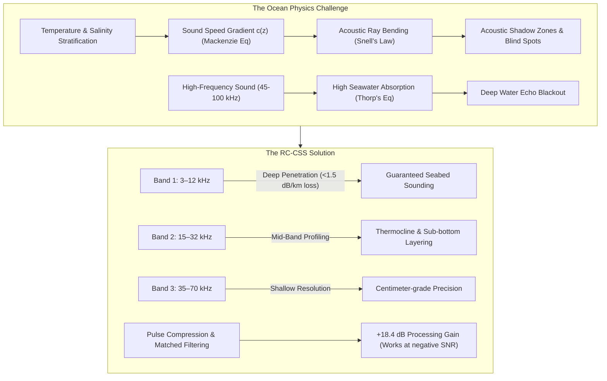

# 🌊 AquaPulse: Project Overview & Architecture Guide

## 📋 Executive Summary
**AquaPulse** is an interactive, web-based physics simulation platform that models **Rolling-Channel Chirp Spread Spectrum (RC-CSS)** acoustic bathymetry and hydrographic sounding for Autonomous Underwater Vehicles (AUVs) and Unmanned Underwater Vehicles (UUVs).

The project demonstrates how ocean physical dynamics (temperature, salinity, depth pressure, sound speed gradients, and absorption) affect underwater acoustic wave propagation, ray bending (Snell's Law), shadow zones, and how multi-band chirp spread spectrum technology solves blind spots in deep ocean sounding.

---

## 🎯 The Core Problem & RC-CSS Solution



---

## 🏗️ Project Architecture & Component Breakdown

The codebase is built using **React 18 + TypeScript + Vite + TailwindCSS** with **HTML5 Canvas** for real-time physics simulation rendering.

```
aqua-pulse/
├── src/
│   ├── main.tsx                   # Application Entry point
│   ├── App.tsx                    # Main Dashboard layout & control state manager
│   ├── index.css                  # Global styles & custom animations
│   ├── types/                     # TypeScript definitions & data structures
│   ├── physics/
│   │   ├── oceanAcoustics.ts      # Core physics engine (Mackenzie, Snell, Thorp, Ray tracing)
│   │   └── presets.ts             # Preconfigured ocean environment profiles
│   └── components/
│       ├── Navbar.tsx             # Header navigation, environment presets, auto-sweep toggle
│       ├── OceanCanvas.tsx        # 2D Real-time canvas interactive ocean & ray-tracer
│       ├── SoundSpeedProfile.tsx  # Dynamic Mackenzie c(z) sound velocity graph
│       ├── SpectrogramWaterfall.tsx # Live time-frequency spectrogram & matched filter spikes
│       ├── BathymetryMap.tsx      # Reconstructed seabed bathymetric point-cloud map
│       ├── PhysicsPanel.tsx       # Live numeric parameters (absorption, TL, SNR, beam width)
│       ├── ComparisonView.tsx     # Side-by-side benchmark (Single-Frequency vs RC-CSS)
│       └── AcousticTheoryModal.tsx# In-app reference manual for ocean acoustics & math
```

---

## 🔬 Core Science & Math Implemented

### 1. Mackenzie (1981) Sound Speed Equation
Sound speed $c$ ($m/s$) is computed dynamically across the water column based on Temperature ($T$), Salinity ($S$), and Depth ($z$):
$$c(T, S, z) = 1449.2 + 4.6T - 0.055T^2 + 0.00029T^3 + (1.34 - 0.010T)(S - 35) + 0.0163z$$

### 2. Snell's Law Ray Tracing
Sound rays bend toward regions of lower sound velocity:
$$\frac{\cos\theta(z)}{c(z)} = \text{Constant (Ray Parameter)}$$

### 3. Thorp's Seawater Absorption Formula
Computes frequency-dependent attenuation $\alpha(f)$ in dB/km:
$$\alpha(f) \approx \frac{0.11 f^2}{1 + f^2} + \frac{44 f^2}{4100 + f^2} + 2.75 \times 10^{-4} f^2 + 0.003$$

---

## 🛠️ Current Status & Actions Undertaken

1. **Environment Setup**: Fixed missing node modules by performing a fresh dependency installation (`pnpm install`).
2. **Local Execution**: Successfully launched the local dev server running Vite on **`http://localhost:3000/`**.
3. **Application Verification**: Verified all interactive modules, ray tracing canvas, controls, and dynamic charts are functioning.

---

## 🚀 How to Run & Interact

### Running the App Locally
```bash
# 1. Install dependencies
pnpm install

# 2. Launch Development Server
pnpm dev

# 3. Open local URL
# http://localhost:3000/
```

### Interactive Controls
- **`Spacebar`**: Trigger acoustic ping transmission.
- **`Arrow Keys / Drag`**: Move the AUV Submersible up/down in depth or horizontally across range.
- **`Auto-Sweep`**: Enable automated channel rolling and sonar pinging.
- **`Presets Dropdown`**: Switch between predefined ocean profiles (*Deep Pacific Trench, Shallow Isothermal, Strong Thermocline, Arctic Polar Water*).
