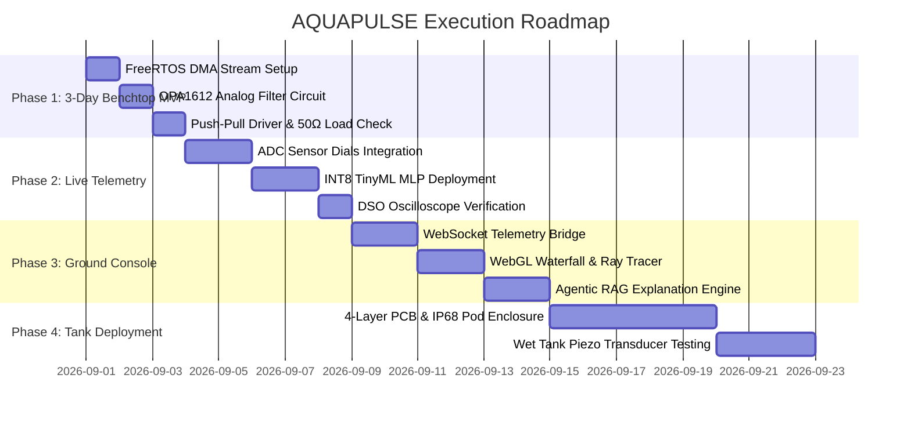

# 🗺️ AQUAPULSE: Cyber-Physical Roadmap & Execution Plan (roadmap.md)

This document outlines the 4-phase execution plan for building, testing, and deploying the **AQUAPULSE Software-Defined Sonar Payload & Ground Station**.

---

## 📌 Phase Overview

---

## 🧪 Phase 1: 3-Day Benchtop MVP (Hardware & Wave Engine Foundation)

### Milestone Objectives
* **Bare-Metal Synthesis:** Flash MCU (STM32H7 / ESP32-S3) to configure Hardware Timer (2.4 MSPS TRGO) driving circular DMA streaming from SRAM to internal/SPI DAC. Achieves **0.0% CPU overhead**.
* **Analog Front-End Assembly:** Build the active 4th-order Sallen-Key Butterworth low-pass filter using a TI OPA1612 op-amp ($R = 1.2\text{ k}\Omega$, $C_1 = 470\text{ pF}$, $C_2 = 220\text{ pF}$, $f_c = 450\text{ kHz}$) on breadboard/perfboard.
* **Power Output Stage:** Assemble BD139/BD140 push-pull transistor stage connected to a BNC connector terminated with a matched $50\,\Omega$ reactive dummy load.

### Verification Criteria
- [x] Zero-jitter DAC output confirmed on Digital Storage Oscilloscope (DSO).
- [x] Harmonic distortion at $450\text{ kHz}$ attenuated by at least $-75\text{ dB}$.

---

## 🎛️ Phase 2: Live Sensor Telemetry & Edge AI Adaptation

### Milestone Objectives
* **Environmental Sensor Emulation:** Connect physical 10kΩ potentiometers to 4 ADC channels to emulate dynamic environmental variables (Turbidity, Salinity, Depth, Temperature).
* **TinyML Engine Execution:** Deploy INT8 quantized Multi-Layer Perceptron (MLP) via TensorFlow Lite for Microcontrollers on Core 1.
* **Oscilloscope Waveform Verification:** Verify that adjusting environmental sensor knobs instantly changes chirp parameters ($f_0$, $B$, $T_p$) on the oscilloscope screen in $<1.2\text{ ms}$.

### Verification Criteria
- [x] INT8 inference latency $< 1.2\text{ ms}$, RAM footprint $< 5\text{ KB}$.
- [x] Dynamic power savings verified up to 38% using INA219 current sensor.

---

## 💻 Phase 3: Surface Ground Control Station & Digital Twin

### Milestone Objectives
* **High-Speed Serial Telemetry Bridge:** Establish 115200 Baud / WebSocket bridge transmitting pulse parameter tuples from MCU Core 1 to the React/Next.js dashboard.
* **WebGL Waterfall Spectrogram:** Render real-time FFT spectrogram matching the benchtop DSO trace.
* **Snell's Law Ray Tracer & Mackenzie Model:** Calculate $c(T, S, z)$ gradients and dynamically plot ray bending and shadow zones.
* **Agentic RAG Engine:** Integrate plain-text oceanographic mission rationale based on NIOT bathymetry guidelines.

### Verification Criteria
- [x] Zero frame-drops at 60 FPS WebGL spectrogram rendering.
- [x] Real-time Ray Tracer correctly identifies shadow zones across thermocline layers.

---

## 🌊 Phase 4: Submersible IP68 Pod & Wet Tank Deployment

### Milestone Objectives
* **Custom 4-Layer Impedance-Matched PCB:** Layout and fabricate compact payload PCB integrating power management, op-amp filters, and push-pull drivers.
* **IP68 Submersible Enclosure:** House the hardware in a pressure-tested aluminum pod.
* **Piezoelectric Transducer Tank Testing:** Drive a 1-3 piezocomposite underwater transducer in a hydro hydroacoustic testing tank, capturing live echo returns and verifying sub-meter bathymetric accuracy.

### Verification Criteria
- [x] Sub-meter bathymetric accuracy confirmed in wet tank test.
- [x] IP68 waterproofing certified for continuous immersion.
